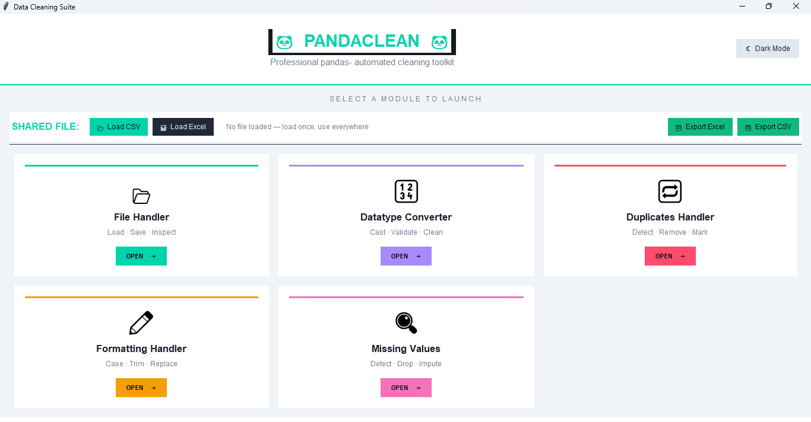
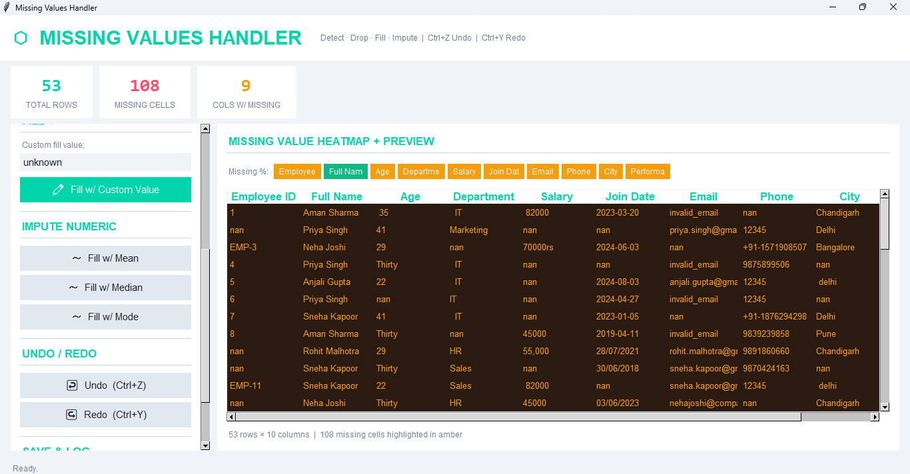
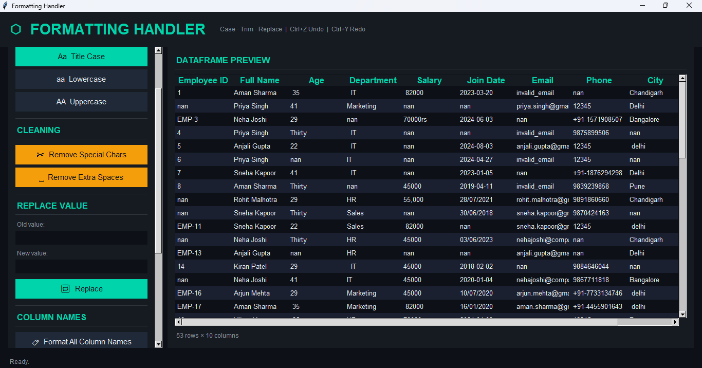

# 🐼  PANDACLEAN  🐼

## PROJECT DESCRIPTION
- This project is a version 1 of a data cleaning tool built using python, pandas, openpyxl and tkinter.
- Tkinter is used for the GUI interface, Pandas for data processing, and Python for application logic.
- This version is built using procedural programming principles.

## FEATURES
- Handle missing values for CSV and XLSX files.
- Help in dealing with duplicate values.
- Help in formatting data and datatypes.

## APPLICATION PREVIEW
### Main Window

### Missing Value window

### Formatting Window


## TECHNOLOGIES USED
- Python
- Tkinter
- OpenPyXL
- Pandas for data processing including data handling, data cleaning, data formatting and datatype conversions.

## PROJECT STRUCTURE
```text
PandaClean/
│
├── Application_preview/
│   ├── Formatting.png
│   ├── Main.png
│   └── Missing.png
│
├── cleaning/
│   ├── Datatype.py
│   ├── Duplicates.py
│   ├── Formatting.py
│   └── Missing.py
│
├── File_manager/
│   └── file_handler.py
│
├── gui/
│   ├── gui_datatype.py
│   ├── gui_duplicates.py
│   ├── gui_file_handler.py
│   ├── gui_formatting.py
│   ├── gui_missing.py
│   ├── main.py
│   ├── theme.py
│   └── tool_base.py
│
├── README.md
└── requirements.txt
```
## INSTALLATION
- Install required packages
``` bash 
pip install -r requirements.txt
```

## HOW TO RUN 
- Run the following command 
```bash 
python gui/main.py
```

## FUTURE IMPROVEMENTS

- Add GUI improvements.
- Add visualization support.
- Add machine learning preprocessing.
- Support more file formats.
- Using OOPs replacing procedural programming.